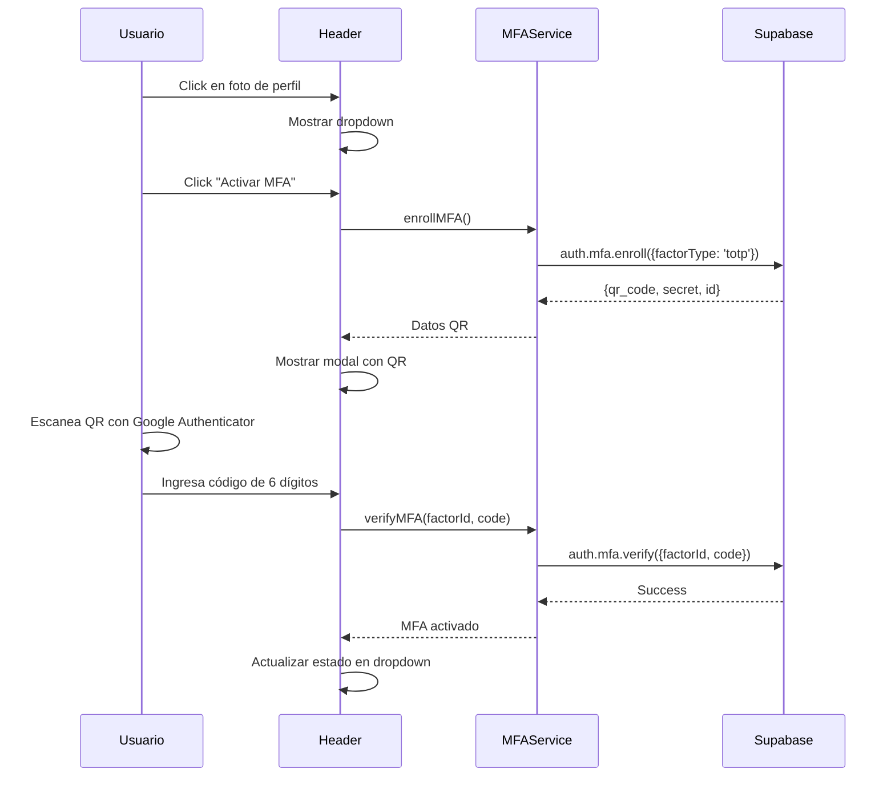
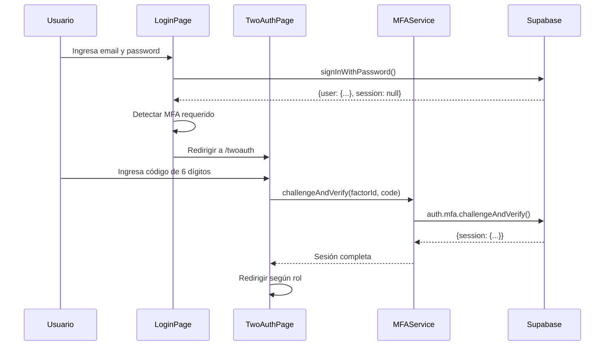
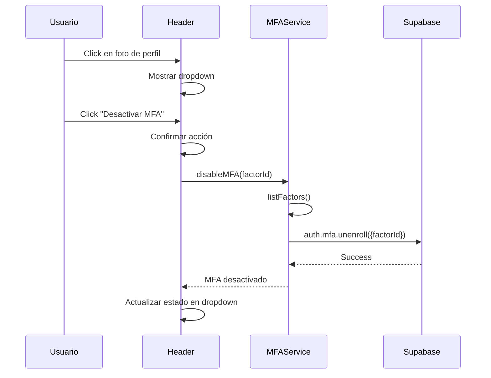

# Implementa

r MFA (Multi-Factor Authentication) con Supabase

## Resumen

Implementar autenticación de dos factores usando TOTP (Google Authenticator) con Supabase. El sistema permitirá a todos los usuarios activar/desactivar MFA desde el Header, activar MFA en la página `/twoauth`, y manejar el flujo de login cuando el usuario tiene MFA habilitado.

## Archivos a modificar

### 1. Frontend - Servicios y utilidades

**`frontend/src/services/auth/mfaService.ts`** (nuevo)

- Servicio para manejar operaciones MFA:
- `enrollMFA()`: Crear factor TOTP y obtener QR
- `verifyMFA()`: Verificar código durante activación
- `listFactors()`: Listar factores del usuario
- `unlistFactor()`: Eliminar factor (desactivar MFA)
- `challengeAndVerify()`: Verificar código durante login
- `hasActiveMFA()`: Verificar si usuario tiene MFA activo

### 2. Frontend - Componentes

**`frontend/src/components/Admin/Header.tsx`**

- Agregar estado para dropdown del perfil
- Implementar dropdown que aparece al hacer click en foto de perfil
- Mostrar estado actual de MFA (activado/desactivado)
- Botones para activar/desactivar MFA
- Integrar con `mfaService`

**`frontend/src/components/Admin/MFAActivationModal.tsx`** (nuevo)

- Modal para activar MFA:
- Mostrar QR code
- Campo para código de verificación
- Instrucciones para escanear con Google Authenticator
- Mostrar código de backup (secret)

**`frontend/src/components/Admin/MFADropdown.tsx`** (nuevo)

- Componente dropdown reutilizable para el menú del perfil
- Opciones: Ver perfil, Activar/Desactivar MFA, Cerrar sesión

### 3. Frontend - Páginas

**`frontend/app/(auth)/twoauth/page.tsx`**

- Reemplazar lógica mock con Supabase MFA real:
- Si viene desde login (con usuario autenticado parcialmente): mostrar verificación MFA para login
- Si es activación directa: mostrar flujo de enroll + verificación
- Integrar con `mfaService` para `challengeAndVerify` o `enrollMFA` + `verifyMFA`
- Manejar estados: `enrolling`, `verifying`, `activated`

**`frontend/app/(auth)/login/page.tsx`**

- Detectar cuando usuario tiene MFA activo:
- Si `data.session === null && data.user !== null`: usuario existe pero requiere MFA
- Redirigir a `/twoauth` con información necesaria (email, factorId)
- Guardar información temporal para continuar el flujo

### 4. Hooks personalizados

**`frontend/src/hooks/useMFA.ts`** (nuevo)

- Hook para gestionar estado MFA:
- `isMFAEnabled`: estado actual
- `loading`: estado de carga
- `enrollMFA`: función para activar
- `disableMFA`: función para desactivar
- `checkMFAStatus`: verificar estado actual

**`frontend/src/hooks/useCurrentUser.ts`** (nuevo)

- Hook para obtener usuario actual:
- Obtener sesión con `supabase.auth.getSession()`
- Retornar datos del usuario para Header

## Flujos de implementación

### Flujo 1: Activación de MFA desde Header

### Flujo 2: Login con MFA

### Flujo 3: Desactivación de MFA

## Consideraciones técnicas

1. **Estado del usuario durante login con MFA**: Cuando `session === null` pero `user !== null`, el usuario está autenticado parcialmente. Necesitamos guardar esta información temporalmente (localStorage o query params).
2. **Manejo de errores**: 

- Código inválido durante verificación
- Usuario sin factores MFA activos
- Error de red

3. **Experiencia de usuario**:

- Mostrar loading states durante operaciones async
- Mensajes de error claros
- Confirmación antes de desactivar MFA

4. **Persistencia de estado MFA**: Verificar estado MFA al cargar Header usando `listFactors()`.

## Dependencias

- Ya instaladas: `@supabase/supabase-js`, `@supabase/ssr`
- No se requieren dependencias adicionales

## Pasos de implementación

1. Crear `mfaService.ts` con todas las funciones MFA
2. Crear hook `useMFA.ts` para estado reactivo
3. Crear hook `useCurrentUser.ts` para obtener usuario actual
4. Crear componente `MFAActivationModal.tsx`
5. Crear componente `MFADropdown.tsx`