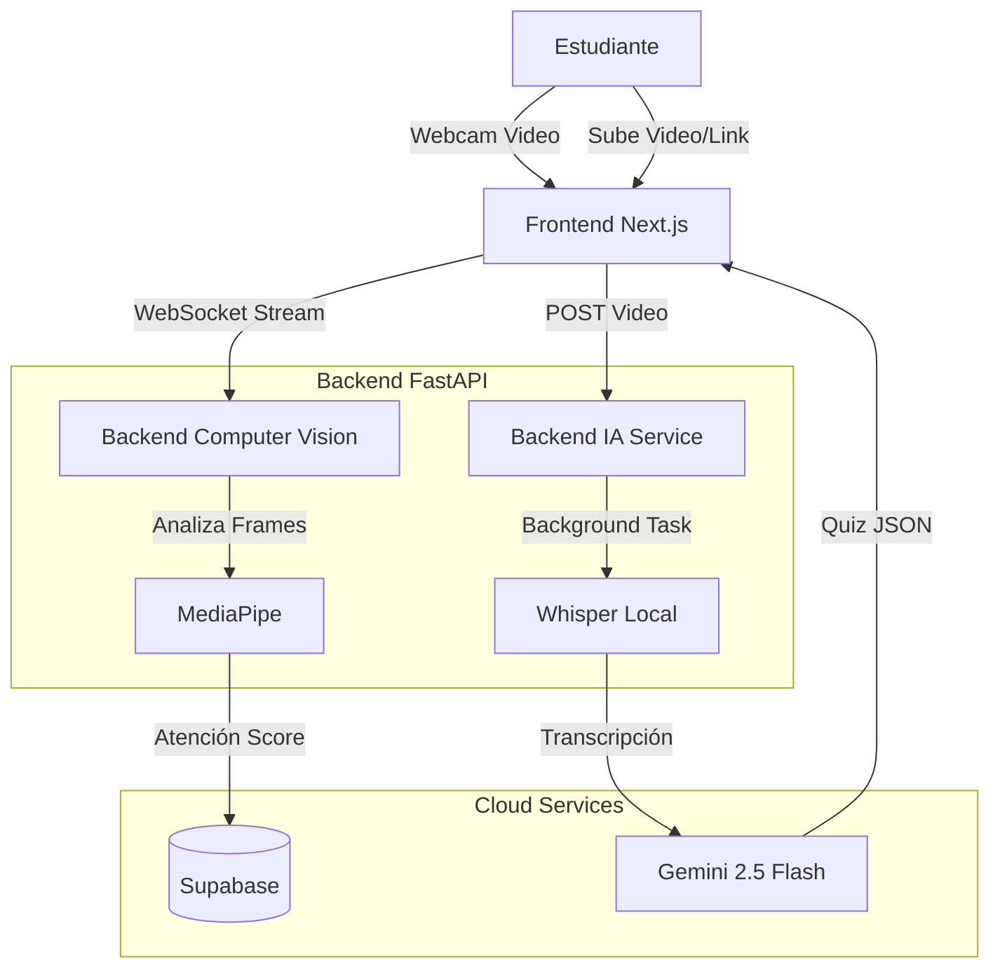

# 🧠 Monitor de Atención y Generación Educativa con IA

> Plataforma educativa inteligente que detecta el nivel de atención del estudiante en tiempo real mediante Computer Vision y genera evaluaciones personalizadas utilizando IA Generativa.

---

## 📋 Descripción del Proyecto

Este sistema está diseñado para mejorar el proceso de aprendizaje híbrido/remoto. Utiliza la cámara web del estudiante para monitorear métricas de atención (parpadeo, postura de la cabeza, mirada) mientras consume contenido educativo.

Al finalizar la lección, el sistema procesa el video, genera una transcripción automática y crea un **Cuestionario Adaptativo** utilizando Inteligencia Artificial. La dificultad del cuestionario se ajusta dinámicamente según el puntaje de atención promedio detectado durante la sesión.

## 🚀 Características Principales

### 👁️ Detección de Aternción (Computer Vision)
- **Motor**: MediaPipe Face Mesh.
- **Métricas**:
    - **EAR (Eye Aspect Ratio)**: Detecta somnolencia y parpadeo frecuente.
    - **Head Pose Estimation**: Detecta si el estudiante mira fuera de la pantalla (Pitch, Yaw, Roll).
- **Procesamiento**: Websockets de alta velocidad para análisis frame a frame en tiempo real sin latencia perceptible.

### 🤖 Inteligencia Artificial Generativa
- **Transcripción de Video**: Implementación local de **OpenAI Whisper** (Modelo Base) procesando videos en segundo plano.
- **Generación de Contenido**: Integración con **Google Gemini 2.5 Flash** para actuar como un "Profesor Experto" y generar preguntas de examen basadas exclusivamente en la transcripción.
- **Personalización**:
    - Atención Baja -> Preguntas de Memoria/Simples.
    - Atención Media -> Preguntas de Comprensión.
    - Atención Alta -> Preguntas de Análisis/Desafiantes.

### 📹 Gestión de Video
- **Soporte Híbrido**:
    - Carga de archivos locales (`.mp4`).
    - Descarga y transcripción automática de enlaces de **YouTube**.
    - Integración con base de datos de videos (Supabase Storage).
- **Robustez**: Lógica de reintentos y fallback automático (Whisper) si la IA generativa falla por sobrecarga.

---

## 🛠️ Stack Tecnológico

### Backend (API & Procesamiento)
- **Lenguaje**: Python 3.11+
- **Framework**: **FastAPI** (Async, WebSockets, BackgroundTasks).
- **IA/ML**:
    - `mediapipe` (Visión Computacional).
    - `openai-whisper` (Speech-to-Text).
    - `google-genai` (LLM SDK).
    - `ffmpeg-python` (Procesamiento de audio/video).
- **Base de Datos**: Supabase (PostgreSQL) via `supabase-py`.

### Frontend (Interfaz de Usuario)
- **Framework**: **Next.js 14** (React, TypeScript).
- **Estilos**: TailwindCSS (UI Moderna y Oscura).
- **Comunicación**: Axios (REST) y API nativa de WebSockets.
- **Multimedia**: Canvas HTML5 para dibujo de malla facial en tiempo real.

---

## 🏗️ Arquitectura del Sistema



---

## 📦 Instalación y Configuración

### Prerrequisitos
- Python 3.10 o superior.
- Node.js 18 o superior.
- Clave de API de Google Gemini (`GEMINI_API_KEY`).
- Credenciales de Supabase (`SUPABASE_URL`, `SUPABASE_KEY`).

### 1. Backend Setup
```bash
cd backend
# Instalar dependencias
pip install -r requirements.txt

# Ejecutar script de instalación de FFmpeg (Windows)
powershell -ExecutionPolicy Bypass -File install_ffmpeg.ps1

# Iniciar Servidor
./restart_backend.bat
# O manualmente: uvicorn main:app --reload --port 8000
```

### 2. Frontend Setup
```bash
cd frontend
# Instalar dependencias
npm install --legacy-peer-deps

# Iniciar Desarrollo
npm run dev
```

---

## 💡 Guía de Uso Rápido

1.  **Detección de Atención**:
    - Navega a `/parpadeo` para probar la detección aislada.
    - Mueve la cabeza o cierra los ojos para ver cómo cambian los indicadores.

2.  **Prueba de IA (Generación de Quiz)**:
    - Ve a `/test-gemini`.
    - **Sube un video** corto o selecciona uno de la lista.
    - Observa el proceso: *Subiendo -> Transcribiendo -> Analizando*.
    - Revisa la transcripción y el quiz generado abajo.

3.  **Flujo Completo**:
    - Inicia sesión como estudiante.
    - Entra a una clase y selecciona un video.
    - Asegura que la cámara esté activa.
    - Al finalizar el video, el sistema calculará tu atención promedio y te redirigirá a un examen personalizado.

---

## 📂 Estructura de Directorios Clave

```
/
├── backend/
│   ├── bin/                  # Binarios locales (ffmpeg)
│   ├── endpoints/            # Rutas de API (Transcribe, GenAI, Detect)
│   ├── services/             # Lógica de Negocio (AIService, TranscriptionService, BlinkService)
│   ├── utils/                # Utilidades de imagen y helpers
│   └── main.py              # Entry point FastAPI
│
├── frontend/
│   ├── app/                  # Rutas Next.js (test-gemini, parpadeo, estudiante)
│   ├── components/           # Componentes React (VideoPlayer, Camera)
│   └── public/               # Assets estáticos
│
└── README.md                 # Documentación del Proyecto
```

> **Nota**: Este proyecto está optimizado para funcionar en entornos locales de Windows, aprovechando aceleración por GPU si está disponible para MediaPipe y Whisper (aunque Whisper está configurado en 'base' para compatibilidad CPU).
